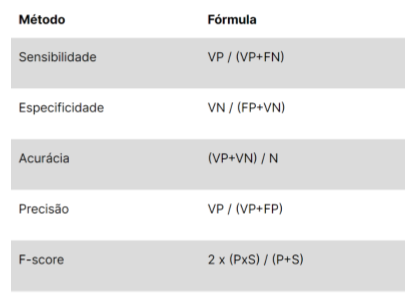

# Cálculo de Métricas de Avaliação de Aprendizado

Neste projeto, vamos calcular as principais métricas para avaliação de modelos de classificação de dados, como acurácia, sensibilidade (recall), especificidade, precisão e F-score. Para que seja possível implementar estas funções, você deve utilizar os métodos e suas fórmulas correspondentes (Tabela 1).

Para a leitura dos valores de VP, VN, FP e FN, será necessário escolher uma matriz de confusão para a base dos cálculos. Essa matriz você pode escolher de forma arbitraria, pois nosso objetivo é entender como funciona cada métrica. A Figura a baixo apresenta as métricas de forma estruturada.



## Métricas?

Em aprendizado de máquina, as métricas estatísticas são ferramentas essenciais para avaliar o desempenho de modelos e comparar diferentes algoritmos. Elas nos permitem quantificar o quão bem um modelo está aprendendo e generalizando a partir dos dados.

Neste guia, vamos explorar algumas das métricas mais comuns usadas em tarefas de classificação e regressão, implementando-as em Python sem o uso de bibliotecas externas.

## Métricas para Classificação

Métricas de classificação medem a correção das previsões de categorias.

- Lida com a previsão de categorias ou classes discretas (por exemplo, "spam" ou "não spam", "gato" ou "cachorro").
- As métricas de classificação avaliam o quão bem um modelo atribui instâncias às classes corretas.
- Métricas comuns incluem acurácia, precisão, recall e F1-score.

### Acurácia (Accuracy)

A acurácia mede a proporção de previsões corretas em relação ao total de previsões.

Podemos pensar na formula resumida da seguinte forma:

```python
accuracy = correct_predictions / total_predictions
```

Voce pode estar se perguntando, como eu vou conseguir calcular as predições corretas?

Bem, para isso iremos precisar comparar todas as nossas predições com as valores reais.

**Algumas observações:**

- Nossa base de dados deve ser rotulada para isso;
- O numero de predições deve ser exatamente igual ao numero de dados rotulados;
- Usaremos listas de dados para comparar os dados;
- O dado predito deve estar na exata mesma posição do rotulo correto, entretanto ambos estão em listas diferentes.

Exemplo de código *python* para calcular o numero de predições corretas.

```python

predicts = [1,1,1,0,1]
corrects = [1,1,1,1,0]

total_items = 5 # temos 5 dados neste exemplo

correct_predictions = 0 # iniciamos as corretas com zero, para ir alterando a cada iteração

for idx in range(total_items):
    if predicts[idx] == corrects[idx]:
        correct_predictions += 1

print("Predições Corretas: ", correct_predictions)
```

Implementação em uma única função para calcular a acurácia.

```python
def accuracy(y_true:list[int], y_pred:list[int]):
    """Calcula a acurácia de um modelo de classificação.

    - Args:
        - y_true: Lista com os rótulos verdadeiros.
        - y_pred: Lista com os rótulos previstos.

    - Returns:
        - float: A acurácia do modelo.
    """
    correct_predictions = sum(1 for true, pred in zip(y_true, y_pred) if true == pred)
    total_predictions = len(y_true)
    return correct_predictions / total_predictions
```

### Precisão (Precision)

A precisão mede a proporção de previsões positivas corretas em relação ao total de previsões positivas.

Algumas observações:

- **1 representa a classe positiva:** Em muitos cenários, especialmente em problemas de detecção (como detecção de spam, detecção de doenças, etc.), uma das classes é considerada a "positiva" e a outra a "negativa". Por convenção, a classe positiva é frequentemente rotulada como 1, e a classe negativa como 0.
- **0 representa a classe negativa:** Consequentemente, a classe negativa é rotulada como 0.

Essa convenção simplifica os cálculos das métricas de classificação, permitindo que nos concentremos em identificar os verdadeiros positivos (casos em que o modelo previu corretamente a classe positiva).

Dito isso, basicamente precisamos realizar 3 passos:

1. Identificar os verdadeiros positivos (VP ou TP) e calcular o somatório
2. Identificar a quantidade de predições feitas para a classe positiva
3. Realizar a divisão da quantidade de classes positivas obtidas no **Passo 1** pela quantidade de predições positivas obtidas no **Passo 2**. Faça isso se e somente se o numero de predições positivas for maior que zero.

Implementação em uma única função para calcular a precisão.

```python
def precision(y_true:list[int], y_pred:list[int]):
    """Calcula a precisão de um modelo de classificação.

    - Args:
        - y_true: Lista com os rótulos verdadeiros.
        - y_pred: Lista com os rótulos previstos.

    - Returns:
        - float: A precisão do modelo.
    """
    true_positives = sum(1 for true, pred in zip(y_true, y_pred) if true == 1 and pred == 1)
    predicted_positives = sum(1 for pred in y_pred if pred == 1)
    return true_positives / predicted_positives if predicted_positives > 0 else 0
```

### Recall (Revocação)

O recall mede a proporção de previsões recall, também conhecido como sensibilidade ou taxa de verdadeiro positivo, mede a proporção de todas as instâncias positivas que foram corretamente identificadas pelo modelo. Em outras palavras, ele responde à pergunta: "De todos os casos que realmente eram positivos, quantos o modelo conseguiu detectar?" positivas corretas em relação ao total de rótulos positivos verdadeiros.

Passos para calcular o Recall:

1. Identificar os Verdadeiros Positivos (VP ou TP): Contar quantas vezes o modelo previu corretamente a classe positiva (1).
2. Identificar os Positivos Reais: Contar quantas vezes a classe positiva (1) aparece nos rótulos verdadeiros.
3. Calcular a Proporção: Dividir o número de Verdadeiros Positivos pelo número total de Positivos Reais.

```python
def recall(y_true:list[int], y_pred:list[int]):
    """Calcula o recall de um modelo de classificação.

    - Args:
        - y_true: Lista com os rótulos verdadeiros.
        - y_pred: Lista com os rótulos previstos.

    - Returns:
        - float: O recall do modelo.
    """
    true_positives = sum(1 for true, pred in zip(y_true, y_pred) if true == 1 and pred == 1)
    actual_positives = sum(1 for true in y_true if true == 1)
    return true_positives / actual_positives if actual_positives > 0 else 0
```

### F1-Score

O F1-score é uma métrica que combina precisão e recall em um único valor, fornecendo um equilíbrio entre ambas. É especialmente útil quando há um desequilíbrio entre as classes.

Como o F1-Score é calculado:

O F1-score é a média harmônica da precisão e do recall. Ele dá mais peso aos valores mais baixos, o que significa que um F1-score alto só é alcançado se tanto a precisão quanto o recall forem altos.

```python
def f1_score(y_true: list[int], y_pred: list[int]):
    """Calcula o F1-score de um modelo de classificação.

    - Args:
        - y_true: Lista com os rótulos verdadeiros.
        - y_pred: Lista com os rótulos previstos.

    - Returns:
        - float: O F1-score do modelo.
    """
    prec = precision(y_true, y_pred)
    rec = recall(y_true, y_pred)
    return 2 * (prec * rec) / (prec + rec) if (prec + rec) > 0 else 0
```

## Métricas para Regressão

Métricas de regressão medem a precisão das previsões de valores numéricos.

- Lida com a previsão de valores contínuos (por exemplo, preço de uma casa, temperatura, vendas).
- As métricas de regressão avaliam o quão próximas as previsões do modelo estão dos valores reais.
- Métricas comuns incluem erro médio absoluto (MAE) e erro quadrático médio (MSE).

### Erro Médio Absoluto (MAE)

O Erro Médio Absoluto (MAE) mede a magnitude média dos erros nas previsões, sem considerar sua direção. Ele calcula a média das diferenças absolutas entre os valores previstos e os valores reais.

Por que usar o MAE?

- É robusto a outliers, pois não eleva os erros ao quadrado.
- Fornece uma medida direta da magnitude do erro.

```python
def mae(y_true:list[float], y_pred:list[float]):
    """Calcula o erro médio absoluto (MAE) de um modelo de regressão.

    - Args:
        - y_true: Lista com os valores reais.
        - y_pred: Lista com os valores previstos.

    - Returns:
        - float: O MAE do modelo.
    """
    absolute_errors = [abs(true - pred) for true, pred in zip(y_true, y_pred)]
    return sum(absolute_errors) / len(y_true)
```

### Erro Quadrático Médio (MSE)

O Erro Quadrático Médio (MSE) mede a média dos quadrados das diferenças entre os valores previstos e os valores reais. Ele penaliza erros maiores mais fortemente do que o MAE.

Por que usar o MSE?

- É sensível a outliers.
- É sensível a outliers.

```python
def mse(y_true:list[float], y_pred:list[float]):
    """Calcula o erro quadrático médio (MSE) de um modelo de regressão.

    - Args:
        - y_true: Lista com os valores reais.
        - y_pred: Lista com os valores previstos.

    - Returns:
        - float: O MSE do modelo.
    """
    squared_errors = [(true - pred) ** 2 for true, pred in zip(y_true, y_pred)]
    return sum(squared_errors) / len(y_true)
```
