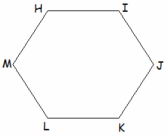

# Algoritmo Ray-Casting

O algoritmo de Ray-Casting é uma técnica utilizada em computação gráfica para determinar a visibilidade de objetos em uma cena tridimensional. Ele é amplamente utilizado em jogos, simulações e renderizações para calcular a interseção de raios com superfícies.

## Funcionamento

1. **Emissão de Raios**: O algoritmo começa emitindo raios a partir de uma fonte (geralmente a câmera ou o ponto de vista do observador) em várias direções.
2. **Interseção com Objetos**: Cada raio é testado para verificar se ele intersecta algum objeto na cena. Isso é feito calculando a interseção do raio com as superfícies dos objetos.
3. **Determinação da Visibilidade**: Se um raio intersecta um objeto, o ponto de interseção mais próximo é considerado visível. Se não houver interseção, o raio continua até atingir um limite ou sair da cena.
4. **Cálculo de Cor e Sombra**: Com base no ponto de interseção, o algoritmo pode calcular a cor do pixel correspondente, levando em consideração a iluminação, sombras e outros efeitos visuais.

## Aplicações

- **Renderização de Imagens**: Utilizado para gerar imagens realistas em gráficos 3D.
- **Simulações de Iluminação**: Ajuda a calcular como a luz interage com os objetos em uma cena.
- **Jogos de Tiro em Primeira Pessoa**: Determina o que o jogador pode ver a partir de sua posição.
- **Detecção de Colisões**: Utilizado para detectar colisões entre objetos em simulações físicas.

## Vantagens

- **Precisão**: Oferece alta precisão na determinação de visibilidade e interseção de objetos.
- **Flexibilidade**: Pode ser adaptado para diferentes tipos de cenas e efeitos visuais.

## Desvantagens

- **Custo Computacional**: Pode ser computacionalmente intensivo, especialmente em cenas complexas com muitos objetos.
- **Performance**: Pode ser mais lento em comparação com outros algoritmos de visibilidade, como o rasterização.

## Exemplo de Código

Aqui está um exemplo simples de como o algoritmo de Ray-Casting pode ser implementado em pseudocódigo:

```pseudocode
for cada pixel na tela:
    raio = calcularRaio(pontoDeVista, pixel)
    interseçãoMaisPróxima = infinito
    objetoMaisPróximo = null

    para cada objeto na cena:
        pontoDeInterseção = calcularInterseção(raio, objeto)
        se pontoDeInterseção é mais próximo que interseçãoMaisPróxima:
            interseçãoMaisPróxima = pontoDeInterseção
            objetoMaisPróximo = objeto

    se objetoMaisPróximo != null:
        cor = calcularCor(objetoMaisPróximo, interseçãoMaisPróxima)
    senão:
        cor = corDeFundo

    desenharPixel(pixel, cor)
```

## Na Prática

Vamos construir duas funções em **Python**, sendo elas a `is_point_inside_polygon` e `apply_mask_to_image`.

- `is_point_inside_polygon` : Usando a técnica de **Ray Casting**, iremos calcular se um determinado ponto está dentro de um objeto poligonal, onde temos apenas as arestas do polígono.
- `apply_mask_to_image` : Usando nossa função `is_point_inside_polygon` iremos aplicar uma mascara para a segmentação de uma imagem, onde toda a zona de interesse ficará intocada, enquanto o restante da imagem ficará completamente `preta`.

Obs: Fique tranquilo que se você não está familiarizado com certos termos, iremos explicar e dar alguns exemplos. Comece observando a Figura 1.



Figura 1: Polígono de exemplo para o experimento.
VÉRTICE
Cada um dos pontos [H, I, J, K, L, M] são as nossas `VÉRTICE` enquanto as linhas que conseguimos traçar entre duas `VÉRTICES` são o que chamamos de `ARESTAS` ou `RETA`. Esses termos vão te ajudar a entender o que o algoritmo faz.

```python
def is_point_inside_polygon(x:int, y:int, polygon: list[list[int]]) -> bool:
    """
    Esta função verifica se um ponto (x, y) está dentro de um polígono.
    Utiliza o algoritmo do teste do número de cruzamentos (Ray Casting).

    O método Ray Casting baseia-se em traçar uma linha imaginária (um "raio") a partir do ponto em questão e contar quantas vezes essa linha cruza as arestas do polígono.

    Se o número de cruzamentos for ímpar, o ponto está dentro do polígono.
    Se o número de cruzamentos for par, o ponto está fora do polígono.

    - Args:
        - x:: int: Coordenada x do ponto
        - y:: int: Coordenada y do ponto
        - polygon:: list[list[int]]: Lista de coordenadas dos pontos do polígono
    - Returns:
        - bool: True se o ponto está dentro do polígono, False caso contrário
    """
    # Número de vértices do polígono (vulgo, pontos que circulam o elemento)
    num_points = len(polygon) 

    # Essa variável será alternada sempre que o "raio" cruzar uma aresta do polígono.
    inside = False 

    for i in range(num_points):
        """
        Cada iteração avalia um segmento do polígono, formado por dois vértices consecutivos
        (x1,y1) -> (x2,y2)
        O operador % num_points conecta o último vértice ao primeiro, garantindo um polígono fechado
        """
        x1, y1 = polygon[i] # Pega o primeiro vértice da sequência
        x2, y2 = polygon[(i + 1) % num_points] #  Pega o próximo vértice da sequência. Se for o último, pega o primeiro.
        """
        A cima, o índice (i+1) se torna igual a (num_points), mas o operador % retorna 0, por que (num_points)%num_points == 0

        Isso faz com que o primeiro vértice do polígono seja usado como o ponto final do segmento, conectando o último vértice de volta ao primeiro.

        Sem o operador %, o algoritmo consideraria apenas os segmentos até (Xn-1, Yn-1), ignorando  conexão final
        (Xn, Yn) -> (X0, Y0)

        Isso resultaria em um polígono aberto, causando erros no teste de interseção para pontos próximos à última aresta.

        Com o uso de %, o algoritmo considera todos os segmentos do polígono, garantindo que o teste de interseção seja feito corretamente. não importa o número de vértices do polígono; o algoritmo sempre tratará o contorno como fechado.
        """

        if y1 > y2:  # Garantir que y1 seja sempre menor ou igual a y2
            # Sempre ordenamos os pontos do segmento para que y1 <= y2, isso simplifica a verificação do cruzamento do "raio".
            """
            - Definição do segmento:
                - Um segmento é definido por dois pontos (x1, y1) e (x2, y2) que formam uma linha reta entre eles.
                - A ordem desses pontos é arbitrária, ou seja, (x1, y1) -> (x2, y2) ou (x2, y2) -> (x1, y1) representam o mesmo segmento.
            - Problema sem ordenação:
                - Ao verificar se o "raio" horizontal que parte de um ponto (x, y) cruza o segmento, precisamos comparar y com as coordenadas verticais (y1, y2) do segmento.
                - Se não garantirmos que y1 <= y2, o algoritmo precisa considerar ambos os casos:
                    - Quando y1 < y2
                    - Quanto y2 < y1
                - Isso complica a lógica do algoritmo, pois precisamos verificar qual é a coordenada y mais baixa e qual é a mais alta.
            - Solução com ordenação:
                - Ao garantir que y1 <= y2, padronizamos a direção do segmento verticalmente. Isso simplifica a verificação:
                    - O "raio" cruza o segmento apenas se Y estiver entre y1 e y2.
                - A comparação se reduz a:
                    - Se y1 <= y <= y2. O ponto pode cruzar o segmento
            """
            x1, y1, x2, y2 = x2, y2, x1, y1
            """
            Exemplo pro bloco acima

            - Se y1 > y2, os pontos estão "fora de ordem" em relação ao eixo y.
            - Por exemplo, imagine um segmento com (x1, y1) = (4,8) e (x2, y2) =(6,3)
            - aqui, y1 = 8 e y2 = 3, o que significa que o segmento está inclinado para baixo. Então os pontos são trocados
            - A troca coloca o ponto mais baixo (y1, x1) primeiro e o ponto mais alto (y2, x2) em seguida. Depois:
                - x1, y1 = x2, y2 = (6,3)
                - x2, y2 = x1, y1 = (4,8)
            - Agora, os pontos estão em ordem crescente em relação ao eixo y. Garantindo que o segmento esteja ordenado verticalmente.
                -   y1 == 3
                -   y2 == 8    
            """

        """
        - Verifica se o ponto está entre as bordas do segmento em y, 6. Verificar se o "raio" cruza o segmento
        - Condições para um cruzamento:
        - y > y1 : O ponto está acima do vértice inferior do segmento.
        - y <= y2 : O ponto está abaixo ou na mesma altura do vértice superior do segmento.
        - x <= max(x1, x2) : O ponto está à esquerda ou na mesma altura do segmento.
        """
        if y > y1 and y <= y2 and x <= max(x1, x2):
            # Calcula o ponto de interseção entre a linha horizontal e o segmento do polígono
            """
            Fórmula da interseção de duas retas:
            x = x1 + (x2 - x1) * (y - y1) / (y2 - y1)
            Calcula onde o "raio" horizontal cruzaria o segmento.
            xinters é o ponto em que o segmento e o "raio" se encontram no eixo x.
            A constante 1e-10 é adicionada para evitar divisão por zero.
            """
            xinters = (y - y1) * (x2 - x1) / (y2 - y1 + 1e-10) + x1

            # Se o ponto de interseção está à direita do ponto inicial (x1, y1)
            # Se Xinter > x, o cruzamento está à direita do ponto
            if xinters > x:
                # Quando isso ocorre, alternamos o estado de inside
                # De False para True (cruzamento ímpar).
                # De True para False (cruzamento par).
                inside = not inside

    return inside


def apply_mask_to_image(
        image: list[list[list[int]]], 
        polygon: list[list[int]],
    ):
    """
    Aplica uma máscara na imagem, deixando somente a zona de interesse colorida.

    - Args:
        - image:: list[list[list[int]]]: Imagem original em RGB
        - polygon:: list[list[int]]: Lista de coordenadas dos pontos do polígono
    - Returns:
        - result:: list[list[list[int]]]: Imagem com a máscara aplicada
    """
    height = len(image)
    width = len(image[0])

    # Cria uma nova imagem para o resultado
    result = [[[0, 0, 0] for _ in range(width)] for _ in range(height)]

    # Verifica pixel por pixel
    for y in range(height):
        for x in range(width):
            if is_point_inside_polygon(x, y, polygon):
                # Se o pixel estiver dentro do polígono, copia o valor original
                result[y][x] = image[y][x]
            else:
                # Caso contrário, mantém o pixel preto
                result[y][x] = [0, 0, 0]

    return result

```

## Referências Úteis

- [Wikipedia](https://pt.wikipedia.org/wiki/Ray_casting)
